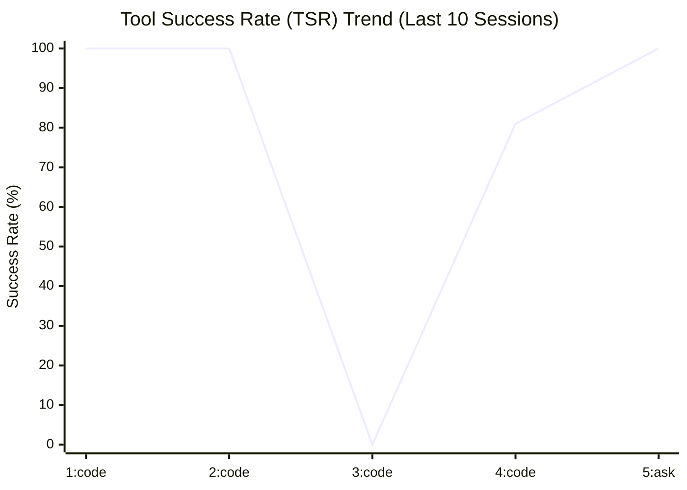
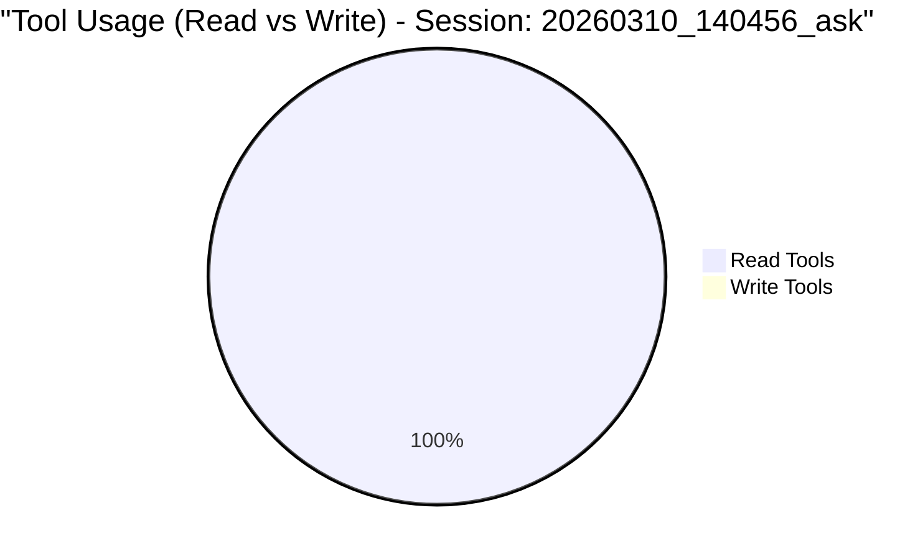
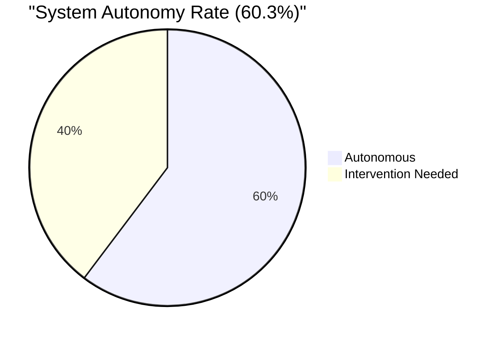

# 🚀 Project Dashboard: Roocode Factory

*Last Updated: 2026-03-14T01:25:11.312717*

## 📊 Visual Metrics Dashboard

### 📈 Tool Success Rate (TSR) Trend

### 🍕 Tool Usage (Last Session)

### 🤖 Autonomy Level

---
## ℹ️ How to read
- **TSR Trend**: Indicates the stability of tool executions. Higher is better.
- **Tool Usage**: Shows the balance between investigation (Read) and implementation (Write).
- **Autonomy**: High autonomy means the agent is completing more tasks without needing manual intervention.

---
[← Back to METRICS.md](../.ops/metrics/METRICS.md) | [Home](../README.md)
