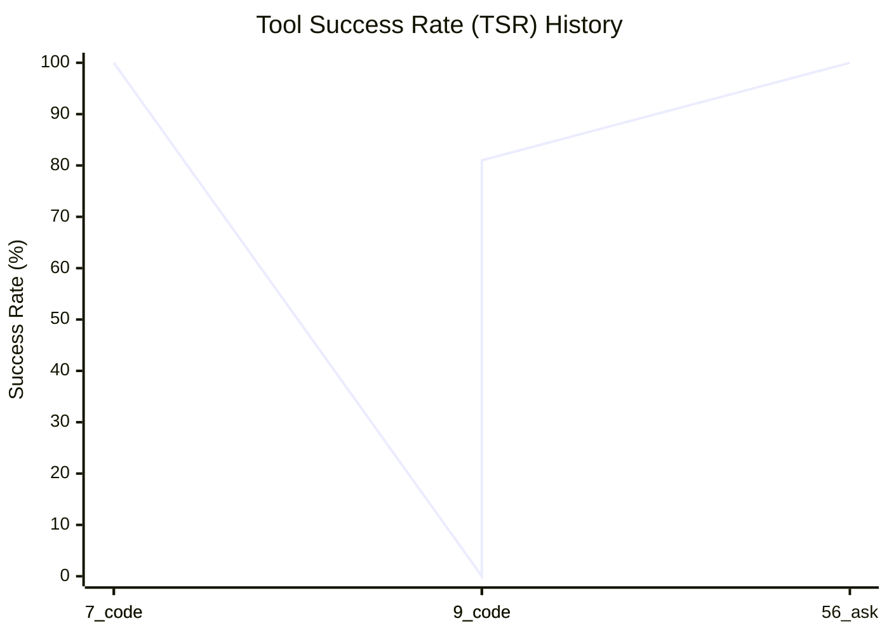
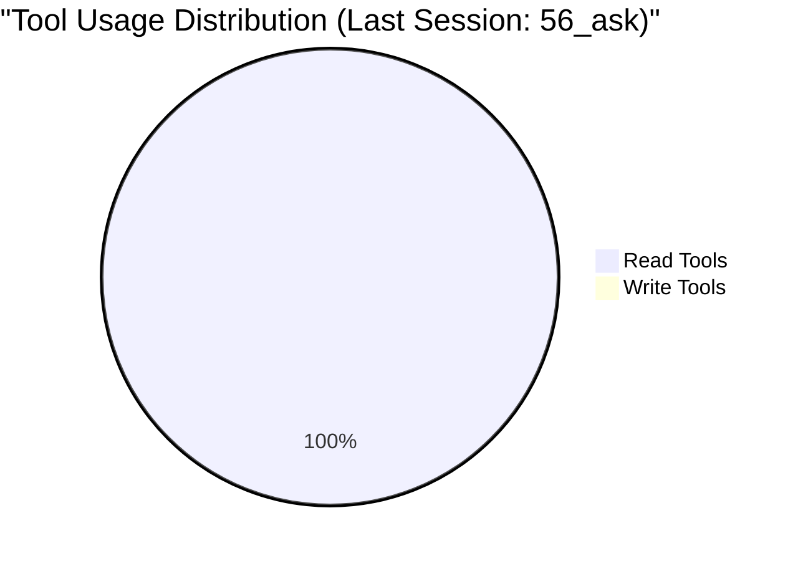

# 🚀 Project Dashboard: Roocode Factory

*Last Updated: 2026-03-13T00:46:23.029657Z*

## 📊 Visual Metrics Dashboard

### 📈 Tool Success Rate (TSR) Trend


### 🍕 Tool Usage (Read vs Write)


### 🤖 Autonomy Level
```mermaid
requirementDiagram
    requirement "System Autonomy"
    id: 1
    text: "60.3%"
    severity: critical
```


---
[← Back to METRICS.md](../.ops/metrics/METRICS.md) | [Home](../README.md)
