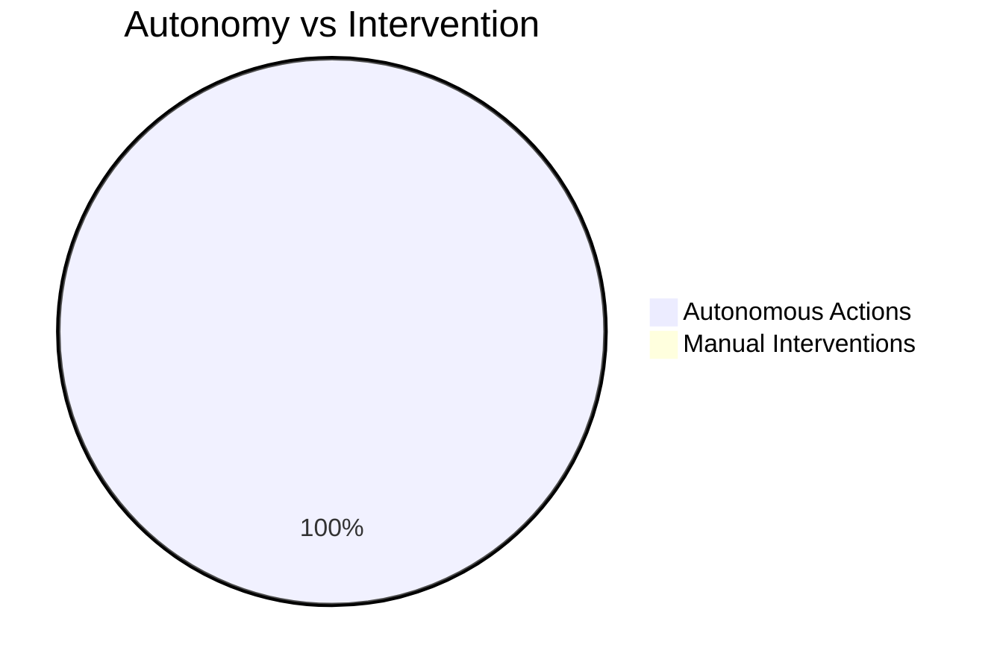
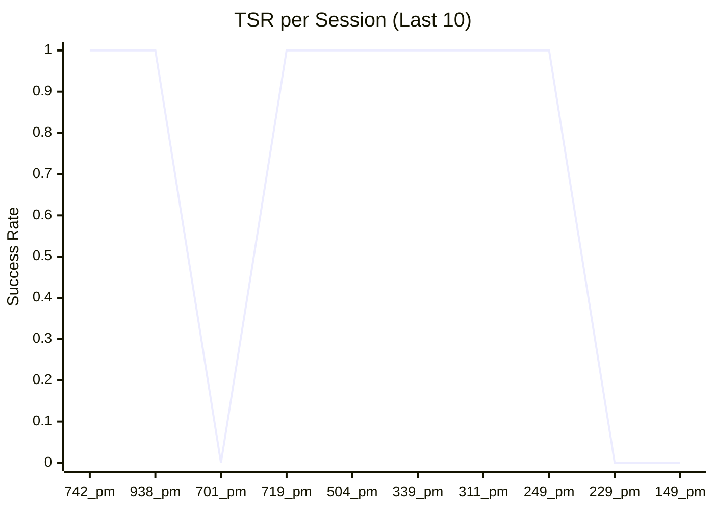
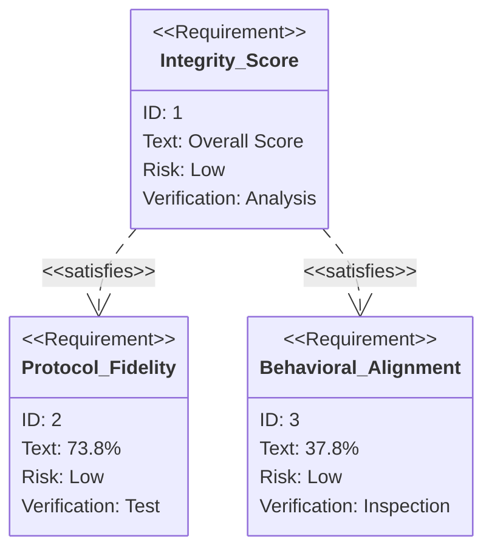

# Metrics Dashboard

This dashboard visualizes the health and performance of the Roocode Factory system based on session logs.

### Autonomy Rate (AI vs Human)

### Tool Success Rate (TSR) Trend

### System Integrity Profile

---
*Last Updated: 2026-04-02T03:12:56.856416Z*
